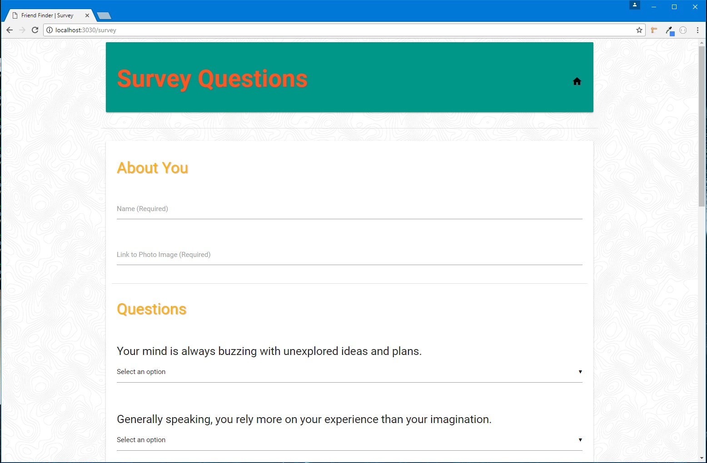

# Friend-Finder
Compatibility-based "FriendFinder" application

## Overview
A web page that lets users fill out a survey and be matched with a friend with similar survey answers.

## Home Page

## Functionality
Front-end is built with `HTML`, `CSS`, `Materialize CSS`, `JavaScript`, and `jQuery`. Back-end is built with `Node` and `Express`.

## Screenshots

### Survey Page

### Matched Friend

## Tech used

    "HTML": "5",
    "CSS": "3",
    "Materialize": "0.99.0",
    "JavaScript": "ECMA-262",
    "jQuery": "3.2.1",
    "Node": "6.11.0 LTS",
    "Express": "4.15.3",

## Authors
*Rutgers Codding Bootcamp Project*
* **Joseph Ball** - [josephtball](https://github.com/josephtball)
